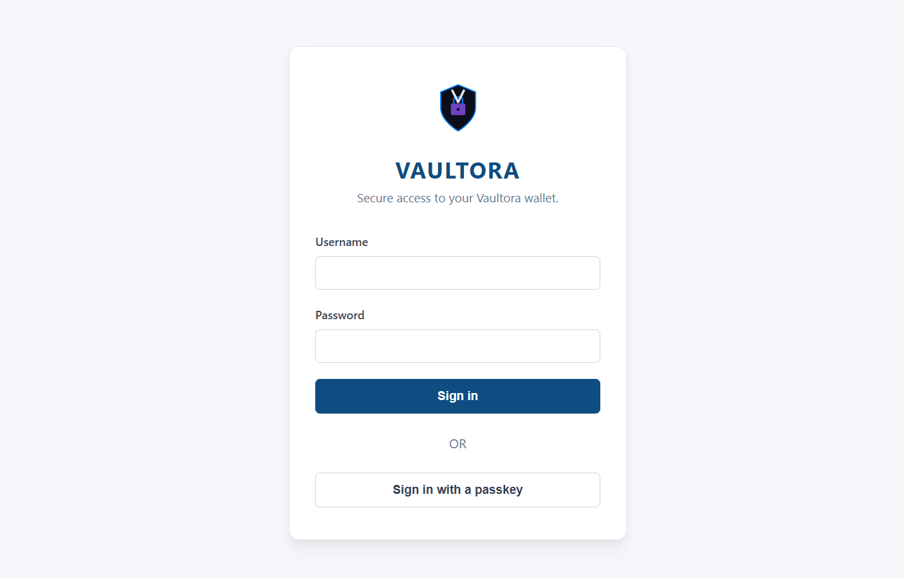

# Protect Identity

In this lab, you will log in to a fictional cryptocurrency account. Your goal is to secure the profile so that the account is less vulnerable to phishing, password attacks, and data breaches, and to minimize the potential impact if a breach occurs.

Connect to the virtual environment using the following details:

> http://x.x.x.x:8080
> **Username**: alex.morgan
> **Password**: AlexVaultora3590

## Challenges
Complete the following security measures:

1. **Minimize exposed account data**
Make the necessary changes to ensure that, in the event of a data breach, as little personal or account information as possible can be compromised.

2. **Change the default password**
Replace the default password with a strong, unique password. Generate the password using the Bitwarden Password Manager browser extension and save the new credentials in Bitwarden.

3. **Enable Multi-Factor Authentication (MFA)**
Configure MFA so that a leaked or compromised password alone is not sufficient to access the account. Enable MFA and verify that it works by testing the login process.